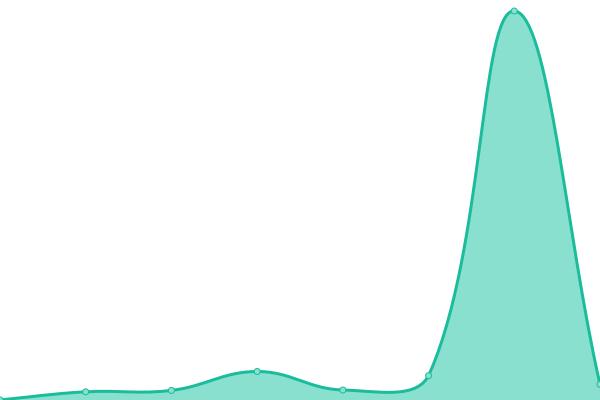
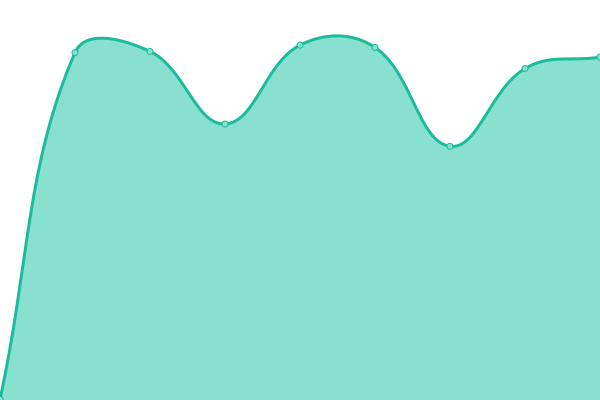

# [📈 Live Status](https://demo.upptime.js.org): <!--live status--> **🟧 Partial outage**

This repository contains the open-source uptime monitor and status page for [Upptime](https://upptime.js.org), powered by [Upptime](https://github.com/upptime/upptime).

With [Upptime](https://upptime.js.org), you can get your own unlimited and free uptime monitor and status page, powered entirely by a GitHub repository. We use [Issues](https://github.com/upptime/upptime/issues) as incident reports, [Actions](https://github.com/KazuoID/upptime/actions) as uptime monitors, and [Pages](https://demo.upptime.js.org) for the status page.

<!--start: status pages-->
<!-- This summary is generated by Upptime (https://github.com/upptime/upptime) -->
<!-- Do not edit this manually, your changes will be overwritten -->
<!-- prettier-ignore -->
| URL | Status | History | Response Time | Uptime |
| --- | ------ | ------- | ------------- | ------ |
|  [LinkTree](https://adit.h4ck.me/linktree/) | 🟩 Up | [link-tree.yml](https://github.com/KazuoID/upptime/commits/HEAD/history/link-tree.yml) | 

 609ms
     
 | 

<a href="https://KazuoID.github.io/upptime/history/link-tree">100.00%</a>
    

|  [MovaLery (MovaWare Gallery)](https://adit.kak.si/) | 🟩 Up | [mova-lery-mova-ware-gallery.yml](https://github.com/KazuoID/upptime/commits/HEAD/history/mova-lery-mova-ware-gallery.yml) | 

 885ms
     
 | 

<a href="https://KazuoID.github.io/upptime/history/mova-lery-mova-ware-gallery">100.00%</a>
    

|  [3D Object testing](https://kazuoid.github.io/3d-obj/) | 🟩 Up | [3-d-object-testing.yml](https://github.com/KazuoID/upptime/commits/HEAD/history/3-d-object-testing.yml) | 

 133ms
     
 | 

<a href="https://KazuoID.github.io/upptime/history/3-d-object-testing">100.00%</a>
    

|  [Cloud Service](https://cloud.ryuxyro.workers.dev/) | 🟩 Up | [cloud-service.yml](https://github.com/KazuoID/upptime/commits/HEAD/history/cloud-service.yml) | 

 490ms
     
 | 

<a href="https://KazuoID.github.io/upptime/history/cloud-service">100.00%</a>
    

|  [Moe Counting](https://moe-count.glitch.me/) | 🟩 Up | [moe-counting.yml](https://github.com/KazuoID/upptime/commits/HEAD/history/moe-counting.yml) | 

 1508ms
     
 | 

<a href="https://KazuoID.github.io/upptime/history/moe-counting">100.00%</a>
    

|  [Portfolio 1](https://adit.h4ck.me/portfolio/) | 🟩 Up | [portfolio-1.yml](https://github.com/KazuoID/upptime/commits/HEAD/history/portfolio-1.yml) | 

 253ms
     
 | 

<a href="https://KazuoID.github.io/upptime/history/portfolio-1">100.00%</a>
    

|  [Portfolio 2](https://adit.zone.id/) | 🟩 Up | [portfolio-2.yml](https://github.com/KazuoID/upptime/commits/HEAD/history/portfolio-2.yml) | 

 614ms
     
 | 

<a href="https://KazuoID.github.io/upptime/history/portfolio-2">100.00%</a>
    

|  [bonus](https://www.ryuxyro.my.id) | 🟩 Up | [bonus.yml](https://github.com/KazuoID/upptime/commits/HEAD/history/bonus.yml) | 

 374ms
     
 | 

<a href="https://KazuoID.github.io/upptime/history/bonus">100.00%</a>
    

|  [v1 (blank)](https://adit.is-a-good.dev/) | 🟩 Up | [v1-blank.yml](https://github.com/KazuoID/upptime/commits/HEAD/history/v1-blank.yml) | 

 506ms
     
 | 

<a href="https://KazuoID.github.io/upptime/history/v1-blank">100.00%</a>
    

|  [v2 (blank)](http://berkah32.my.id/) | 🟥 Down | [v2-blank.yml](https://github.com/KazuoID/upptime/commits/HEAD/history/v2-blank.yml) | 

 0ms
     
 | 

<a href="https://KazuoID.github.io/upptime/history/v2-blank">0.00%</a>
    

|  [v3 (blank)](https://movaware.my.id) | 🟩 Up | [v3-blank.yml](https://github.com/KazuoID/upptime/commits/HEAD/history/v3-blank.yml) | 

 519ms
     
 | 

<a href="https://KazuoID.github.io/upptime/history/v3-blank">100.00%</a>
    

|  [v4 (blank)](http://exemova.xyz) | 🟩 Up | [v4-blank.yml](https://github.com/KazuoID/upptime/commits/HEAD/history/v4-blank.yml) | 

 3205ms
     
 | 

<a href="https://KazuoID.github.io/upptime/history/v4-blank">100.00%</a>
    

|  [v5 (blank)](http://epizy.my.id) | 🟩 Up | [v5-blank.yml](https://github.com/KazuoID/upptime/commits/HEAD/history/v5-blank.yml) | 

 596ms
     
 | 

<a href="https://KazuoID.github.io/upptime/history/v5-blank">100.00%</a>
    

|  [v6 (blank)](http://kazuoyuuka.xyz/) | 🟩 Up | [v6-blank.yml](https://github.com/KazuoID/upptime/commits/HEAD/history/v6-blank.yml) | 

 526ms
     
 | 

<a href="https://KazuoID.github.io/upptime/history/v6-blank">100.00%</a>
    

|  [upptime 1](https://kazuoid.github.io/upptime/) | 🟩 Up | [upptime-1.yml](https://github.com/KazuoID/upptime/commits/HEAD/history/upptime-1.yml) | 

 142ms
     
 | 

<a href="https://KazuoID.github.io/upptime/history/upptime-1">100.00%</a>
    

|  [upptime 2](https://ryuxyro.github.io/status/) | 🟩 Up | [upptime-2.yml](https://github.com/KazuoID/upptime/commits/HEAD/history/upptime-2.yml) | 

 231ms
     
 | 

<a href="https://KazuoID.github.io/upptime/history/upptime-2">100.00%</a>
    

<!--end: status pages-->

[**Visit our status website →**](https://demo.upptime.js.org)

## 📄 License

- Powered by: [Upptime](https://github.com/upptime/upptime)
- Code: [MIT](./LICENSE) © [Anand Chowdhary](https://anandchowdhary.com), supported by [Pabio](https://pabio.com)
- Data in the `./history` directory: [Open Database License](https://opendatacommons.org/licenses/odbl/1-0/)
